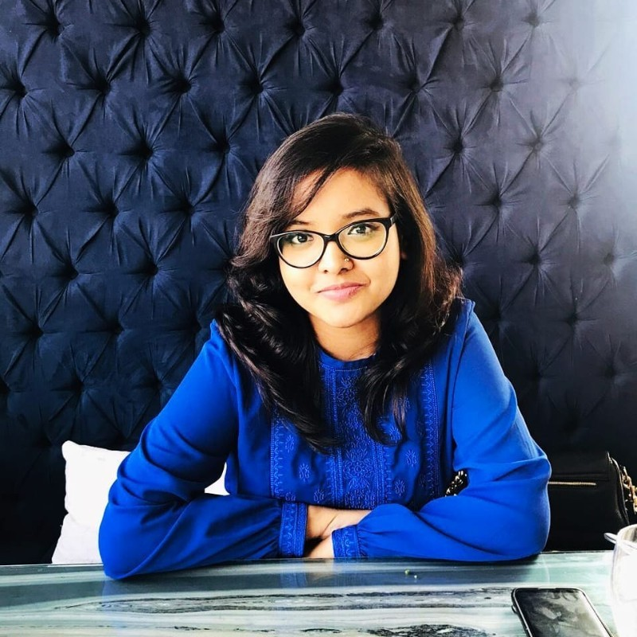

# Hi, I'm Lubaba Bazlul 👋

### Research-Oriented Product Technologist | Aspiring Researcher in Human-Computer Interaction

I bridge the gap between technology and human experience through data-driven, empathetic design. With 5+ years in product management and a deep commitment to digital inclusion, I'm pursuing graduate studies in **Human-Computer Interaction** and **Human-Centered AI**.

---

## 🎓 About Me

I am driven by a commitment to humanitarian technology research that facilitates people of all ages and educational backgrounds through thoughtful technological interventions. My work centers on designing systems that prioritize optimized user interactions, particularly for underserved communities.

Throughout my academic and professional journey, I have focused on user-centric technology for social impact. My research has explored critical humanitarian challenges, from conducting focus group studies with Rohingya refugees and healthcare workers to understand mental health interventions, to developing CNN-based detection models for domestic violence victims. With over five years as a Technical Product Owner at leading organizations like bKash and Grameenphone, I have designed products serving millions of users with varying digital literacy levels, achieving significant growth through data-driven, empathetic design.

**Current Focus:** Pursuing graduate studies in Human-Computer Interaction and Human-Centered AI to investigate methods for designing inclusive, accessible technologies that bridge the gap between advanced AI systems and diverse user needs.

---

## 🔬 Research Interests

- **Human-Computer Interaction (HCI)**
- **Human-Centered Artificial Intelligence**
- **Digital & Financial Inclusion**
- **Accessibility & Inclusive Design**
- **User Experience Research**
- **Social Impact Technology**

---

## 📚 Publications

<table>
<tr>
<td width="60%">

**Analysis of Soil and Various Geotechnical Properties using Data Mining Techniques**

_IEEE 10th International Conference on Intelligent Systems (IS), 2020_

Suparna Biswas, Tarek Ibne Faysal, Arshi Siddiqui Promiti, Md. Sazzad Hossain, **Lubaba Bazlul**, Abdullah Md. Sarwar, Sayeed Md. Shaiban, Rashedur M. Rahman

</td>
<td width="40%">

**Soil Analysis and Unconfined Compression Test Study using Data Mining Techniques**

_ICCCI 2020, Communications in Computer and Information Science, vol 1287. Springer_

Abdullah Md. Sarwar, Sayeed Md. Shaiban, Suparna Biswas, Arshi Siddiqui, Tarek Ibne Faysal, **Lubaba Bazlul**, Md. Sazzad Hossain, Rashedur M. Rahman

</td>
</tr>
<tr>
<td colspan="2">

**Exploring Challenges and Solution Approaches Regarding Wellbeing of Female Rohingya Community in Bangladesh**

_TENCON 2019 - IEEE Region 10 Conference_

Kimia Tuz Zaman, Wordh Ul Hasan, **Lubaba Bazlul**, Tamanna Motahar, Nova Ahmed

</td>
</tr>
</table>

---

## 💡 Featured Projects

### 🚨 Domestic Violence Detection using Deep Learning

**Capstone Project | North South University | IEEE YESIST12 Finalist 2019**

Developed a CNN-based model to classify violent acts in videos and integrated it with an IoT alert system for timely assistance to victims. This project addresses the societal issue of domestic violence by notifying predetermined contacts when violent behavior is detected, combining user experience design with the need for instant support while ensuring data integrity.

**Tech Stack:** TensorFlow, OpenCV, Python, IoT, Raspberry Pi  
**Impact:** Finalist at IEEE YESIST12 Maker Fair, Thailand

---

### 🏕️ Wellbeing of Female Rohingya Community in Bangladesh

**IEEE TENCON 2019**

Conducted comprehensive qualitative research exploring challenges faced by female Rohingya refugees in Bangladesh. Performed focus group studies with doctors (N=22) and Rohingya women (N=10), along with questionnaire-based quantitative study (N=105). Utilized HCI principles to propose technology interventions for enhancing mental well-being after severe trauma from ethnic cleansing.

**Focus Areas:** User Research, Social Impact, Vulnerable Populations, HCI  
**Methods:** Focus Groups, Surveys, Qualitative Analysis

---

### 📱 Digital Financial Inclusion Products | bKash Limited

**200K+ Monthly Active Users | 138% YoY Growth**

Led product innovation through mixed-method user research and data-driven insights for users with varying digital literacy levels. Conducted interviews, surveys (SurveyMonkey, Typeform), and thematic analysis of event-stream data to develop acceptance criteria and user journeys for bKash app and bKash Agent app. Created solutions accessible through both smartphone applications and feature codes, addressing the reality that 45% of Bangladeshis lack smartphones and 56% don't use the internet.

**Key Achievement:** Led product innovation resulting in 138% YoY growth in user onboarding, 178% in usage, and 125% in revenue
**Tech Stack:** NewRelic, Mixpanel, Tableau, Power BI, SurveyMonkey, Typeform

---

### 📡 Payment Orchestration & Subscription Layer | Grameenphone

**Industry-First Meta Collaboration**

Led the design and launch of digital payment orchestration across multiple platforms (MyGP, Skitto, GP Website). Pioneered industry-first features including 0-balance recharge capability through Facebook (Meta collaboration), Auto Recharge for recurring payments, Nagad Direct Charge integration, and personalized in-app campaigns through Denodo API integration. Each product designed with user-centered principles to enhance convenience and ensure seamless connectivity for users with varying digital literacy.

**Key Features:** Auto Recharge, 0-balance recharge, Nagad MFS Integration, Denodo APIs, Multi-channel orchestration
**Impact:** Achieved 6% drop-off reduction through conversion rate optimization and enhanced digital financial inclusion across Bangladesh's largest telecom network

---

## 🛠️ Technical Skills

### Languages & Frameworks

### Machine Learning & Data Science

### Product & Design Tools

### Development & Database

---

## 💼 Professional Experience

**Product, Tech & Partnership Lead** | Grameenphone Ltd.
_Dec 2023 - Present_
Payment Orchestration Layer | Digital Channels & Distribution

- Designed and launched Auto Recharge feature enabling recurring recharge orders, enhancing convenience and ensuring uninterrupted connectivity
- Enabled personalized in-app campaigns by integrating Denodo APIs with curated user journeys for improved engagement
- Analyzed Mixpanel data for Conversion Rate Optimization achieving 6% drop-off reduction through A/B testing and UI/UX improvements
- Integrated Nagad Direct Charge for one-tap recharge payments via Nagad MFS wallet, reducing user drop-off
- Integrated 0-balance recharge solution in MyGP app, Skitto app, and Facebook (Meta collaboration) for emergency scenarios

**Product Owner** | bKash Limited
_Jun 2021 - Nov 2023_
Product Management, App Operations & Essential Services | Product & Technology Division

- Achieved 138% YoY growth in user onboarding, 178% in usage, and 125% in revenue through data-driven product innovation for 200K+ MAU
- Developed acceptance criteria and user journeys for bKash app and bKash Agent app using data insights and user studies
- Conducted mixed-method user research using interviews, surveys (SurveyMonkey, Typeform), and thematic analysis of event-stream data and New Relic logs
- Applied research outcomes to UI/UX design and API contracts for users with varying digital literacy levels
- Created dynamic dashboards and data visualizations using Tableau and Power BI to analyze market trends and customer behavior

**Engineer, Quality Assurance** | bKash Limited
_Mar 2020 - Jun 2021_
Research Engineering | Product & Technology Division

- Reviewed product requirements and API documentation to design comprehensive test cases for bKash Agent app
- Designed test cases, executed test cycles, tracked bug life cycles, and generated bug reports for high-quality releases
- Created comprehensive test reports to summarize results and provide insights for future improvement
- Analyzed logs and app metrics to identify issues and improve overall product performance
- Defined fallback strategies for external integrations ensuring seamless user experience during service disruptions

**Undergraduate Teaching Assistant** | North South University
_Jan 2019 - Dec 2019_
Department of Computer Science and Engineering & Department of Mathematics and Physics

- Graded scripts and source code, providing feedback to students in Pre Calculus and Digital Logic Design courses
- Assisted faculty with course material preparation and assignment grading
- Provided personalized and small group assistance to support student learning objectives
- Proctored exams ensuring testing integrity and supportive environment
- Reviewed students' progress through test scores, homework completion, and class participation

---

## 🎓 Education

**Bachelor of Science in Computer Science and Engineering**  
North South University, Dhaka, Bangladesh | 2016 - 2020  
CGPA: 3.54/4.0

---

## 🏆 Achievements

🥇 **Finalist** - IEEE YESIST12 Makerfair 2019, Thailand  
_Project: An IoT Device for Domestic Violence Detection_

👩‍💼 **Vice Chair** - IEEE North South University Women in Engineering (2018-2020)

🌏 **Bangladesh Delegate** - Youth Camp for Asia's Future, South Korea (2015)

---

## 🌟 Beyond Research

<table>
<tr>
<td width="50%" align="center">

 
<em>IEEE WIE International Leadership Summit</em>
</td>
<td width="50%" align="center">

 
<em>Embracing challenges beyond the lab</em>
</td>
</tr>
</table>

---

### 📫 Let's Connect

I'm actively seeking opportunities to pursue graduate studies in HCI and Human-Centered AI.  
Open to research collaborations and discussions about inclusive technology design.

---

_"Technology should empower everyone, not just the digitally literate."_

